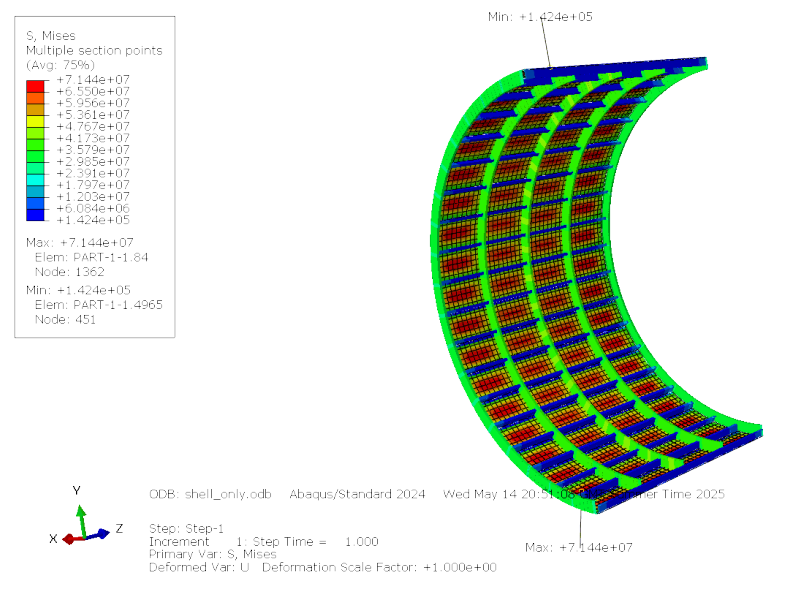
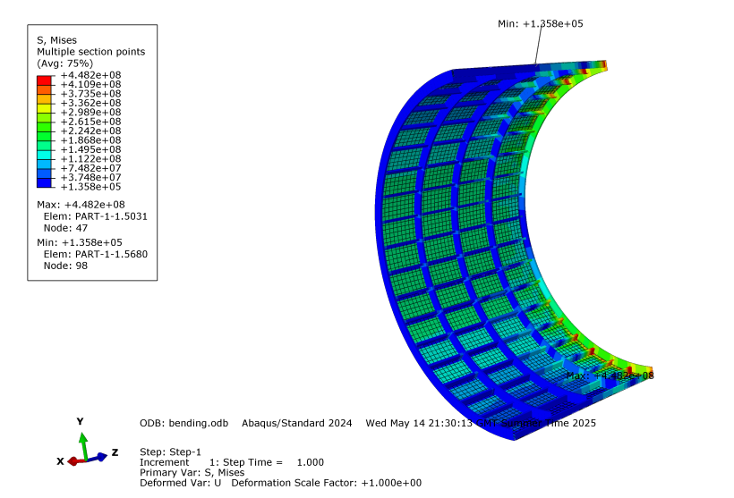
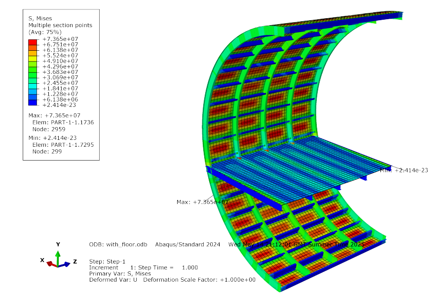

# Fuselage Structural Analysis — Conceptual Aircraft for Aspen-Pitkin Airport

> **Group Design Project** · Aerospace Engineering · FEA & Structural Sizing  
> Tools: `CATIA` · `Abaqus` · `SpaceClaim` · `Python`

---

## Overview

This project involved the complete structural design and finite element validation of a commercial aircraft fuselage optimised for high-altitude operations at Aspen-Pitkin County Airport (ASE), elevation ~7 800 ft. The fuselage — 38.4 m long with a 3.35 m diameter — was sized analytically and then validated using FEA under multiple operational load cases.

My contributions covered:
- Preliminary analytical sizing of skin thickness, stringers, and ring frames
- Material selection across 8 aerospace aluminium alloys
- FEA simulation setup and post-processing for internal pressure, bending, and floor loading cases

---

## Preliminary Sizing

Analytical sizing followed the Arandara–Howe methodology for a semi-monocoque fuselage structure with built-up Z-stringers.

### Governing equations

**Hoop stress (pressure skin thickness)**

$$t_p = \frac{\Delta P \cdot R}{\sigma_p}$$

**Bending stress**

$$\sigma_a = F_B \cdot \bar{A} \cdot \sqrt{\frac{M}{A \cdot L}}$$

**Effective skin thickness (bending)**

$$t_e = \frac{M}{\sigma_a \cdot A}$$

### Key sizing results

| Parameter | Value |
|-----------|-------|
| Fuselage radius | 1.675 m |
| Fuselage length | 38.4 m |
| Skin thickness — pressure (hoop) | 1.26 mm |
| Effective skin thickness — bending | **3.12 mm** ← governs |
| Bending stress σ\_a | 109.4 MPa |
| Stringer thickness t\_b | 2.03 mm |
| Stringer height h\_s | 81.1 mm |
| Number of stringers | 39 |
| Ring frame web height | 100 mm |
| Number of ring frames | 76 |

> Bending controls the skin thickness at 3.12 mm vs 1.26 mm from pressure — typical for commercial fuselages at this scale.

---

## Material Selection

Eight aluminium alloys from the **2xxx** (Cu-based) and **7xxx** (Zn-based) series were evaluated — both commonly used in aerospace fuselage applications. Selection was sequential: skin → ring frames → stringers.

### Candidate materials

| Material | E (GPa) | σ\_y (MPa) | ρ (kg/m³) |
|----------|---------|-----------|----------|
| AA 2090-T83 | 79.00 | 455 | **2 580** |
| AA 2014-T6  | 72.40 | 414 | 2 800 |
| AA 2024-T3  | 72.40 | 345 | 2 780 |
| AA 7075-T6  | 71.70 | **503** | 2 810 |
| AA 2024-T81 | 72.40 | 450 | 2 780 |
| AA 2195-T8  | 69.00 | **560** | 2 700 |
| AA 7475-T61 | 70.30 | 490 | 2 810 |
| AA 7079-T6  | 70.00 | 450 | 2 804 |

### Selection rationale

**Skin → AA 2090-T83**  
Tested under Case 1 (internal pressure) with ring frames/stringers fixed as AA 7075-T6. AA 2090-T83 achieved the lowest deformation (1.16 mm) and, crucially, the lowest density (2 580 kg/m³) — significantly lighter than comparable performers. Since the skin dominates fuselage weight, this choice delivers the largest weight saving.

**Ring frames → AA 7075-T6**  
Tested across 32 material combinations (4 stringer baselines × 8 ring frame materials). AA 7075-T6 achieved joint-lowest deformation (0.98 mm) and a high yield stress of 503 MPa. Notably, using AA 2090-T83 for all components simultaneously produced *higher* stress and deformation than the mixed-material approach — demonstrating that system-level performance is not simply additive.

**Stringers → AA 2195-T8**  
Tested under Case 2 (bending), which governs stringer loading as they primarily carry longitudinal bending loads. AA 2195-T8 achieved the lowest stress (56.44 MPa) and the second-lowest density (2 700 kg/m³).

### Final assignments

| Component | Material | σ\_y (MPa) | ρ (kg/m³) |
|-----------|----------|-----------|----------|
| Skin | AA 2090-T83 | 455 | 2 580 |
| Ring frames | AA 7075-T6 | 503 | 2 810 |
| Stringers | AA 2195-T8 | 560 | 2 700 |

---

## FEA Load Cases & Results

All FEA simulations were run in **Abaqus**. A 2-metre fuselage section was used for bending cases to reduce computational cost; the full geometry was used for pressure cases. Symmetry boundary conditions halved the model where applicable.

---

### Case 1 — Internal Pressure

**Setup**

| Parameter | Value |
|-----------|-------|
| Internal cabin pressure | 81 000 Pa (equiv. 6 000 ft atmosphere) |
| External pressure (cruise) | 2 500 Pa |
| Differential pressure ΔP | 78 500 Pa |
| Design load factor | 1.5 |
| Effective pressure applied | **117 750 Pa** |

Boundary conditions: X-axis and Z-axis symmetry. Full fuselage geometry modelled.

**Results**

| Component | Material | Observed stress (MPa) | Yield stress (MPa) | Utilisation |
|-----------|----------|-----------------------|-------------------|-------------|
| Skin | AA 2090-T83 | **71.83** | 455 | 15.8% |
| Ring frame | AA 7075-T6 | 42.00 | 503 | 8.4% |
| Stringer | AA 2195-T8 | 20.00 | 560 | 3.6% |

- Maximum deformation: **2.04 mm**
- Maximum von Mises stress: **71.83 MPa** (skin)
- All components operate below 16% of their yield strength — substantial safety margins

> Internal pressure is a low-utilisation case. The skin carries the majority of hoop stress, as expected for a pressurised cylinder, while ring frames and stringers experience minimal load from this case alone.

---

### Case 2 — Bending

**Setup**

| Parameter | Value |
|-----------|-------|
| Total fuselage + payload mass | 12 500 kg |
| Half-section modelled | 6 250 kg |
| Additional loads (wings + fuel) + load factor 2 | → 15 000 kg final |
| Applied force | **~147 000 N** |

Boundary conditions: ENCASTRE (fully fixed) at one end; X-axis symmetry. Section idealised as cantilever.

**Results**

| Component | Material | Observed stress (MPa) | Yield stress (MPa) | Utilisation |
|-----------|----------|-----------------------|-------------------|-------------|
| Skin | AA 2090-T83 | 260 | 455 | 57.1% |
| Ring frame | AA 7075-T6 | 360 | 503 | 71.6% |
| Stringer | AA 2195-T8 | **448** | 560 | **80.0%** |

- Maximum deformation: **13.56 mm** (stringers and ring frames)
- Maximum stress: **448 MPa** (stringers)
- All components remain below yield; stringers are the critical element

> Bending is the **governing load case** across all scenarios. The stringers reach 80% utilisation — tight but safe. The skin performs well under bending, experiencing minimal deformation relative to the axial members.

---

### Case 4 — Floor Loading

**Setup**

Same pressurisation as Case 1, with a shell-element floor (I-beam stiffeners) added at 1.21 m above the fuselage base. Floor thickness and material match the skin.

| Parameter | Value |
|-----------|-------|
| Seats modelled | 10 (2 m floor, 0.8 m pitch, 4-abreast) |
| Passenger mass | 100 kg each |
| Seat mass | 12 kg each |
| Total section load | 1 120 kg → 10 987 N |
| Floor area | 3.35 m² |
| Floor pressure applied | **3 279.76 Pa** |

Boundary conditions: X and Z symmetry on skin; unbound floor edge constrained in X; front/back floor edges ENCASTRE.

**Results**

| Component | Material | Max stress (MPa) | Max deformation (mm) | Yield (MPa) |
|-----------|----------|-----------------|----------------------|-------------|
| Skin | AA 2090-T83 | 73.65 | 2.95 | 455 |
| Ring frame | AA 7075-T6 | 49.10 | 2.95 | 503 |
| Stringer | AA 2195-T8 | 18.41 | 2.95 | 560 |
| Floor | AA 2090-T83 | 42.96 | **11.94** | 455 |
| Floor stiffener | AA 7075-T6 | 67.51 | 0.46 | 503 |

- Shell deformation: ~3 mm (consistent with Case 1)
- Floor centre deformation: **11.94 mm** (furthest point from skin)
- Peak stiffener stress at skin junction: 67.51 MPa; under 1 MPa at the free end

> The 11.94 mm floor deformation is the most notable outcome. However, average floor stress is low and the structure can sustain this position in operation. The simulation excluded the E195-style floor support stilts for simplicity — including them would likely reduce floor deflection to below 10 mm and reduce stiffener stress at the skin junction.

---

## Contour Plots

### Case 1 — Internal Pressure

   
  <b>Von Mises stress</b> — max 71.83 MPa at skin · max deformation 2.04 mm

---

### Case 2 — Bending

   
  <b>Von Mises stress</b> — max 448 MPa at stringers (80% utilisation) · max deformation 13.56 mm

---

### Case 4 — Floor Loading

   
  <b>Von Mises stress</b> — max 73.65 MPa at skin · floor centre deformation 11.94 mm

---

## Summary

| Load case | Critical component | Max stress (MPa) | Yield (MPa) | Utilisation | Max deformation (mm) |
|-----------|-------------------|-----------------|-------------|-------------|----------------------|
| Case 1 — Internal pressure | Skin | 71.83 | 455 | 15.8% | 2.04 |
| Case 2 — Bending | **Stringers** | **448** | 560 | **80.0%** | 13.56 |
| Case 4 — Floor loading | Skin | 73.65 | 455 | 16.2% | 11.94 (floor) |

All components across every load case remain within their material yield limits. Bending is the governing scenario and drove the stringer material selection. The mixed-material approach — rather than a single alloy throughout — proved critical: system-level interaction effects mean the optimal individual material does not always produce the optimal structural system.

---

---

## Skills Demonstrated

- Structural sizing of pressurised fuselage using semi-monocoque theory (Arandara–Howe)
- Multi-criteria material selection across 8 aerospace alloys with 32+ FEA combinations
- FEA model setup in Abaqus: boundary conditions, symmetry, load application
- CFD-to-FEA workflow: external pressure extracted from Ansys Fluent simulations
- Python scripting for parametric structural sizing (see `fuselage_sizing.py` in this repo)

---

*Group 3 · Conceptual Aircraft Design · 2024–25*
